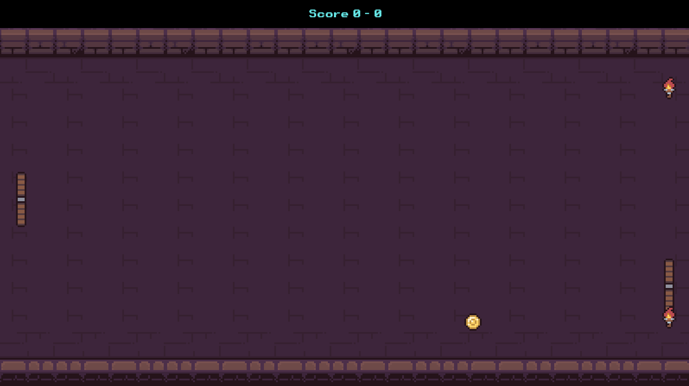

# Infini-Pong - Bevy 0.13.2

This is a small project i built to learn some of Bevy.

It's *very* minimal and the collision system is *very* buggy but it does serve to demonstrate a number of concepts in bevy that might be helpful to someone elses learning.

While learning and creating my project I mostly used the following:
  - https://bevy-cheatbook.github.io
  - https://bevyengine.org/examples
  - https://github.com/CiderSlime/dungeon-quest
  - Bevy Discord - https://discord.com/invite/bevy

  - Credit to https://pixel-poem.itch.io/dungeon-assetpuck being used for the visuals

This is a very small project but structured as if it is a larger scale one, like dungeon-quest above.

Hopefully this is useful for your Bevy learning.

## Bevy / general gamedev concepts in this project
  - Standard ECS concepts
  - States
  - Schedules & Run Conditions
  - Resources
        - Default and Runtime loading of resources
        - Texture Loading / Handling with 
  - Queries
        - Uniques, Bundles, Combinations, Filters, Transmutation, Change Detection, ParamSets
  - Commands
        - Spawning / Despawning
  - Events
  - Plugins
        - Used for code organisation. Ideas mostly from: https://github.com/CiderSlime/dungeon-quest
  - Input Handling
  - Parent-Child Hierarchys
  - Transforms
  - Timer
  - 2D Camera
        - LetterBoxing

## Mobile
This project was envisioned as a cross-platform mobile first game \n
Below are the build specific steps for each mobile platform

### Android
`todo!()`

### iOS
`todo!()`